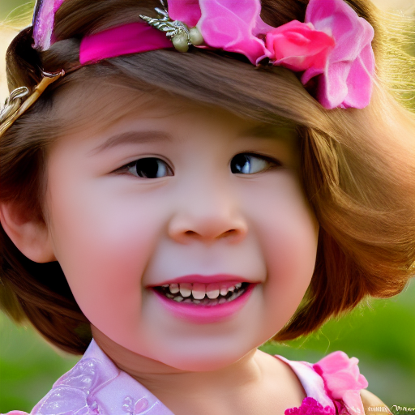

# Test

- `Prompt : portrait girl, disney style`

|Input| Landmarks| Results                 |
|---|---|-------------------------|
|  |  |  |
| ||  |
||||
# 결론
1. pretrained 모델로 사용하기엔 무리가 있다.
2. 가지고 있는 데이터로 controlnet이나 dreambooth를 finetuning 하는 방향으로 재설정 해야겠다.